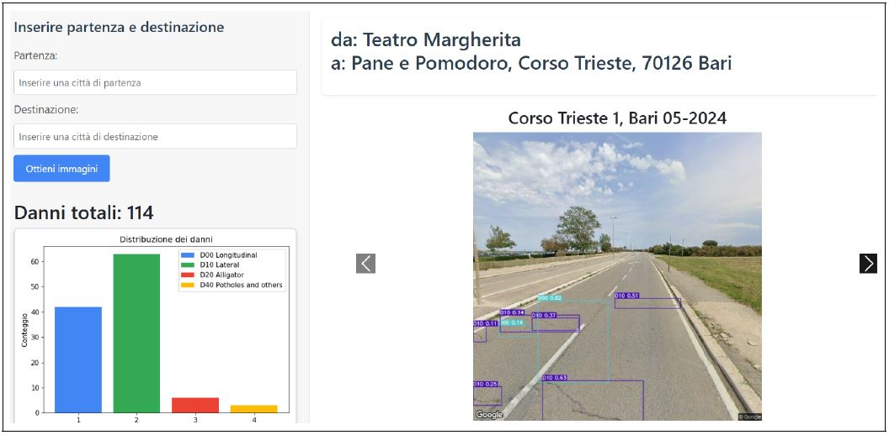
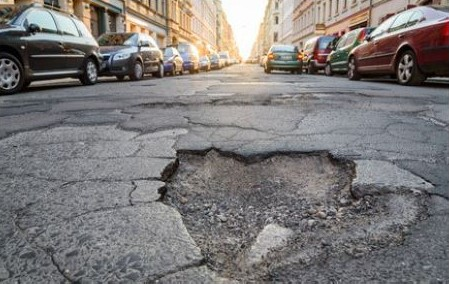
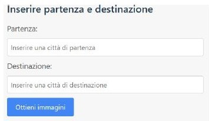
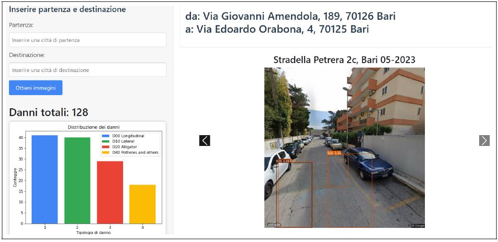

# 🕳️ Road Damage Detection Web-App

<div align="center">
  
</div>

This project aims to develop an innovative web application for the **automatic detection of road damage** along specific routes, leveraging advanced machine learning models and cloud technologies. The goal is to demonstrate a practical feature that could be integrated into **Google Maps** or other navigation tools, allowing users to be informed about the **road damage conditions** along their route helping them to **avoid damaged or hazardous roads**.

<div align="center">
  
</div>

## 🚀 Key Features

- 📍 Integration with **Google Maps API** and **OpenStreetMap** to acquire up-to-date routes and street images.
- 🤖 Use of the famous **YOLOv7** by Ultralytics model for **detecting and classifying road damage**, such as cracks and potholes.  
- 🧱 Visual identification of detected damages overlaid on maps for intuitive navigation.  
- 🧠 A **Model-View-Controller (MVC)** architecture built with the **Flask** framework ensures modularity, scalability, and maintainability.

## 🧪 Example

1. The user inserts the departure and destination locations in the input box, then it pushes the "Obtain images" button.

<div align="center">
  
</div>

2. An API call is made to OpenStreetMap to obtain the route. Then, coordinates are extracted from received route and are used to query Google Street View in order to obtain images.  
The received images are pre-processed and passed as input to the Yolov7 model. The final result is the following

<div align="center">
  
</div>

3. On the right, a carousel showing detected damages on the route's road. On the left, a graphic that shows stathistics about the distribution of detected damages among the classes: Longitudinal, Lateral and Alligator Cracks, and Potholes.
---

## 🚀 Usage

1. Clone the repository:
```bash
git clone https://github.com/GiuseppeFarano/road-damage-detection.git
cd road-damage-detection
 ```
2. Set your Google Maps API in the file model/inference.py and your Google Cloud Platform API in the file model/obtain_images.py
```bash
API_KEY = 'your_google_maps_api_key_here'
```
3. Create a new virtual environment and install the required libraries from requirements.txt
```bash
pip install -r requirements.txt
```
4. Download the pre-trained Yolov7x_640 model from [here](https://drive.usercontent.google.com/download?id=1DGfQivLLGR-uP3INUZv6P77VrOa_rtNt&export=download).

5. Launch the Flask Application
```bash
python app.py
```
---

## 🪪 License

This project is distributed under the Apache 2.0 License

---

## 👨‍💻 Authors

- Giuseppe Farano
- Vito Guida
- Antonio Colacicco

---
If you're looking for a broader overview of the methodology and technologies used, check out the [project presentation](static/presentation.pdf).  
For a more detailed and technical explanation, refer to the [technical report](static/technical_report.pdf).

> ⚠️ This project was developed for educational purposes as part of a university course. It is **not intended for production use**.

If you have any questions about the project or are interested in turning it into a live application, feel free to **contact the authors**.
